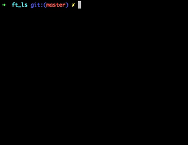
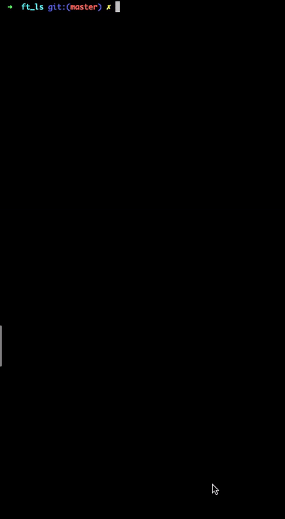

# ft_ls
My own version of unix command ls
Handles flags	: Raltrugf1
Different colours for different file types
No memory leaks.
Handles ACL

# Compilation
In order to get the excutable ft_ls you will have to use the Makefile to create an executable.

## First time compilation
To compile the executable run the following:

    make
    
Please follow the inforgraphic below:

## Recompilation
To recomplie the project after making some changes

   make re

You can also delete file with:
   
   make clean
   make fclean

